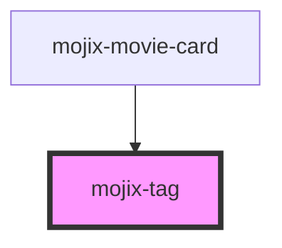

# mojix-tag

<!-- Auto Generated Below -->

## Properties

| Property  | Attribute | Description | Type      | Default     |
| --------- | --------- | ----------- | --------- | ----------- |
| `disable` | `disable` |             | `boolean` | `undefined` |
| `icon`    | `icon`    |             | `string`  | `undefined` |
| `link`    | `link`    |             | `string`  | `undefined` |

## Dependencies

### Used by

 - [mojix-movie-card](../mojix-movie-card)

### Graph

----------------------------------------------

*Built with [StencilJS](https://stenciljs.com/)*
